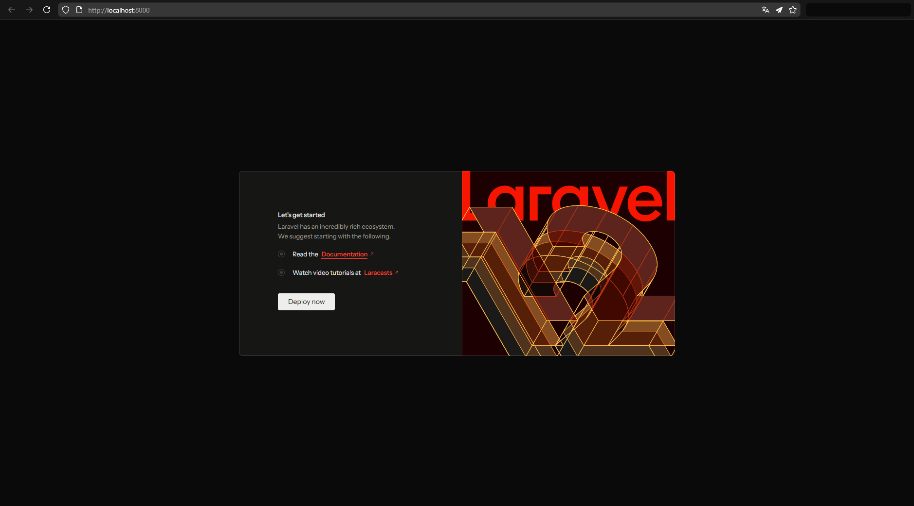

# Estudio del framework Laravel

- [Estudio del framework Laravel](#estudio-del-framework-laravel)
  - [**Estudio teórico**](#estudio-teórico)
    - [Introducción](#introducción)
      - [¿Qué es?](#qué-es)
      - [¿Para qué sirve?](#para-qué-sirve)
    - [Características principales](#características-principales)
    - [Ventajas](#ventajas)
    - [Desventajas](#desventajas)
    - [Diferencias con PHP base (sin frameworks)](#diferencias-con-php-base-sin-frameworks)
    - [Estructura de directorios](#estructura-de-directorios)
    - [Referencias](#referencias)
  - [**Estudio practico**](#estudio-practico)
    - [Primeros pasos (Preparar el entorno)](#primeros-pasos-preparar-el-entorno)
      - [Instalación](#instalación)
        - [PHP](#php)
        - [Composer](#composer)
        - [Laravel](#laravel)
        - [NodeJS y npm](#nodejs-y-npm)
      - [Configuración](#configuración)
    - [Creación de un proyecto](#creación-de-un-proyecto)
    - [Configurar el proyecto](#configurar-el-proyecto)
    - [Artisan](#artisan)


## **Estudio teórico**

### Introducción

#### ¿Qué es?

Laravel es un framework de código abierto de PHP que da una estructura fija para crear aplicaciones web. \
En vez de que tú tengas que organizar todo desde cero, Laravel ya trae una forma de trabajar: carpetas ordenadas, archivos separados por función y muchas herramientas listas para usar.

#### ¿Para qué sirve?

Sirve para facilitar la creación de aplicaciones y paginas web de una forma mas rápida y estructurada. \
Ayuda especialmente en tareas típicas y que se repiten mucho en el desarrollo.

### Características principales

- Crea rutas para decidir qué hace la web cuando un usuario entra a una URL especifica.
- Usa el patrón de diseño **MVC (*Modelo-Vista-Controlador*)** para organizar los datos, lógica e interfaz.
- Gestión de la DB usando **Eloquent ORM** sin escribir SQL directamente.
- Gestión del control de acceso sin tener que programarlo de cero.
- Crear plantillas con **Blade** para reutilizar las vistas.
- Proteger la aplicación con sistemas ya integrados para ayudar a prevenir y protegerse de los ataques.

### Ventajas

- Fácil de aprender.
- Una gran comunidad activa.
- Código organizado y fácil de mantener.
- Trabajar con bases de datos de forma más sencilla y segura.
- Permite reutilizar código fácilmente con las plantillas.
- Seguridad integrada contra ataques comunes.

### Desventajas

- Requiere aprender su forma de trabajar con MVC, que puede ser complejo al principio.
- Para aplicaciones muy simples puede añadir complejidad innecesaria.
- Alguna actualización podría romper el código existente.

### Diferencias con PHP base (sin frameworks)

- Total control del código, sin estructura impuesta.
- Se debe programar todo desde cero, incluso tareas repetitivas.
- Mayor riesgo de errores de seguridad si no se tiene experiencia.
- No hay herramientas integradas para rutas, plantillas o bases de datos.

### Estructura de directorios

[Según la documentación oficial](https://laravel.com/docs/12.x/structure):
- `app/`: Contiene el código principal de la aplicación, incluyendo controladores, modelos, y lógica de negocio.
- `bootstrap/`: Incluye archivos para arrancar y configurar el framework.
- `config/`: Almacena todos los archivos de configuración de la aplicación, como la base de datos, caché y sesiones.
- `database/`: Contiene las migraciones, semillas y factorías de la base de datos.
- `public/`: Es el único directorio que debe ser accesible públicamente a través del servidor web. Contiene el archivo index.php y el resto de archivos de la aplicación.
- `resources/`: Contiene los recursos no compilados.
    - `lang/`: Para los textos del sitio en diferentes idiomas.
    - `views/`: Almacena las vistas de la aplicación (archivos Blade).
- `routes/`: Define las rutas de la aplicación en archivos como web.php y api.php.
- `storage/`: Contiene los archivos generados por la aplicación, como logs, caché de Blade y sesiones.
- `tests/`: Contiene los archivos para pruebas de unidad y de integración.
- `vendor/`: Contiene todas las dependencias del proyecto, gestionadas por Composer.

### Referencias

Tutorial oficial: https://laravel.com/learn/getting-started-with-laravel

Documentación oficial: https://laravel.com/docs/12.x

Curso Laravel YouTube: https://www.youtube.com/playlist?list=PLZ2ovOgdI-kVtF2yQ2kiZetWWTmOQoUSG


## **Estudio practico**

### Primeros pasos (Preparar el entorno)

#### Instalación

Para usar Laravel tenemos que instalar PHP, Composer, el propio Laravel para poder crear la aplicación y NodeJS y npm para compilar los archivos del frontend.

##### PHP

Abrimos una terminal y ponemos:
```powershell
winget install PHP.PHP.8.4 # Para el usuario actual
# o
winget install PHP.PHP.8.4 --scope machine # Para todos los usuarios
```
(uso PHP8.4 porque actualmente es [la ultima versión de PHP compatible con Laravel 12 (la ultima versión actualmente)](https://laravel.com/docs/12.x/releases#:~:text=12,-8%2E2)).

Esto instalara PHP 8.4 automáticamente y lo añadirá a PATH.

Después, lo [configuramos](#configuración).

##### Composer

Vamos a https://getcomposer.org/download/ y, descargamos y ejecutamos "***Composer-Setup.exe***".

Le damos a instalar para todos o solo este usuario según queramos. En las opciones de instalación le damos a siguiente hasta instalar.

##### Laravel

Abrimos una nueva terminal para recargar los PATH, y ponemos:
```powershell
composer global require laravel/installer
```

Esto instalara Laravel y todas sus dependencias.

##### NodeJS y npm

Vamos a https://nodejs.org/es/download y abajo, le damos al botón para descargar el `.msi`.

Lo ejecutamos, le damos a siguiente, aceptamos la licencia, y le damos a siguiente hasta instalar.

#### Configuración

Para ver donde esta y configurar el archivo de php.ini podemos usar:
```powershell
(Get-Command php).Source
```

Por defecto el archivo tiene dos php.ini: `php.ini-development` y `php.ini-production`.

El de desarrollo lo copiamos y lo pegamos como `php.ini`, al final de todo el archivo ponemos:
```ini
extension_dir = "ext"
extension=curl
extension=fileinfo
extension=mbstring
extension=openssl
extension=pdo_mysql
```

### Creación de un proyecto

Para crear un proyecto, se haría por terminal haciendo algo tipo:
```
C:\...\proyectos> laravel new nombre_proyecto
```
Nos preguntara ***( yo he seleccionado )***:
1. Que kit de inicio queremos usar. ***( El predeterminado: none )***
2. Que framework para test preferimos. ***( El predeterminado: Pest )***
3. Si queremos instalar "Laravel Boost" para programación con IA. ***( No )***
4. *... [Se instalaran un montón de paquetes y dependencias] ...*
5. Que base de datos usaremos. ***( mariadb )***
6. Si queremos hacer las migraciones por defecto a la DB. ***( El predeterminado: yes )***
7. *... [Se instalaran todavía mas paquetes y dependencias] ...*
8. Si queremos hacer `npm install` y `npm run build`. ***( El predeterminado: yes )***

Al terminar creara una carpeta con el nombre del proyecto que contenga todos los archivos y directorio iniciales.

Hacemos:
```bash
cd nombre_proyecto  # Para ir al proyecto
composer run dev    # Para iniciar el servidor web
```

Ahora, si vamos a http://localhost:8000/ podremos ver esta pagina:


### Configurar el proyecto

Para configurar el proyecto están el archivo `.env` que hay el la raíz del proyecto y los archivos de la carpeta `/config`.

El `.env` es el archivo de config principal. Ahí podemos configurar varias cosas. *(Los mas importantes siendo el **nombre de la aplicación**, el **entorno de desarrollo**, la **clave para encriptar datos**, si mostraremos **mensajes de error** en la app, la **url de la app** y la **DB que usaremos con su usuario y contraseña**)*

Para configurar la zona horaria, en la carpeta `/config` el archivo `app.php` buscamos "***timezone***", y lo ponemos en "***Europe/Madrid***".

### Artisan

¿Qué es artisan? Es la salvación, la segunda venida de Jesucristo y el 33% del poder de Ambrosio.

Básicamente, todo lo que necesites hacer lo puedes hacer con artisan.

Puedes iniciar un servidor web con:
```bash
php artisan serve
```

Crear vistas, modelos, controladores, componentes y mas con:
```bash
php artisan make:<lo que quieras> <nombre que quieres que tenga>
```

Crear las tablas de la DB con:
```bash
php artisan migrate
```
